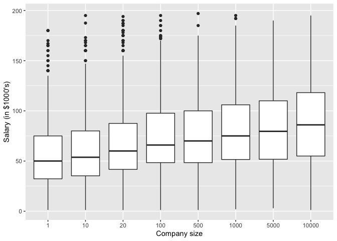
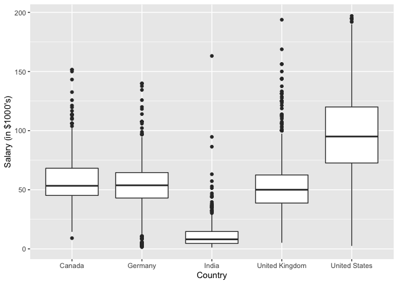
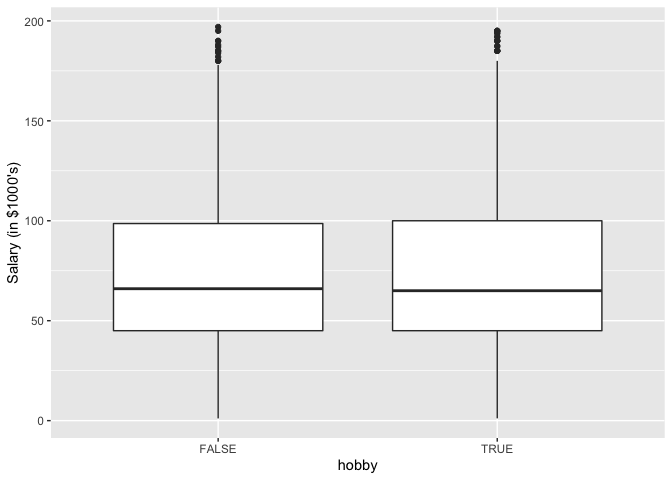
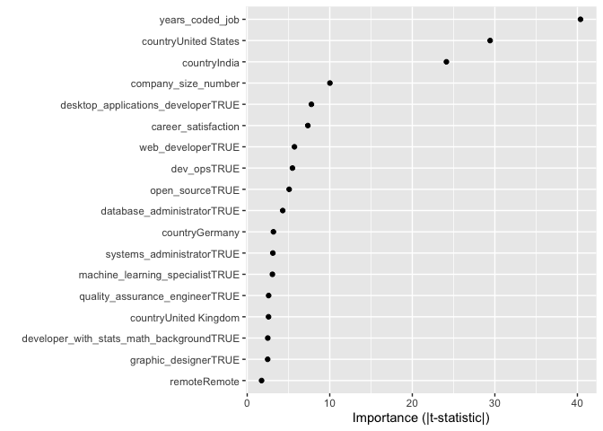
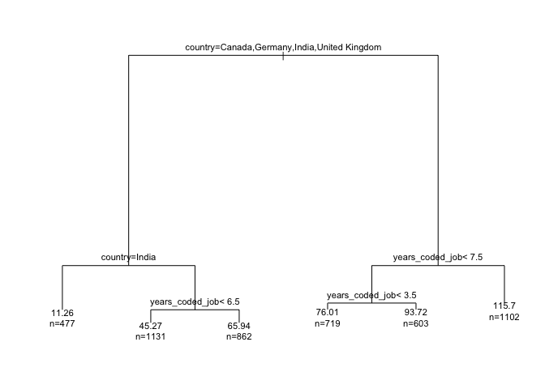
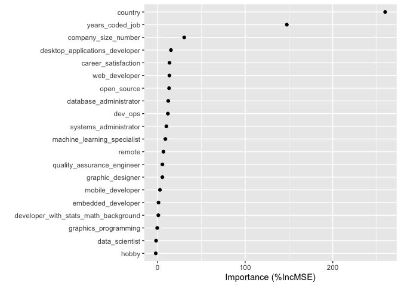
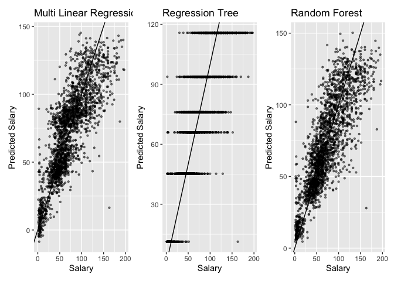

Final Project - Dan Hoang - Cu2107
================

``` r
library(tidyverse)
```

    ## ── Attaching packages ─────────────────────────────────────── tidyverse 1.3.1 ──

    ## ✔ ggplot2 3.3.6     ✔ purrr   0.3.4
    ## ✔ tibble  3.1.7     ✔ dplyr   1.0.9
    ## ✔ tidyr   1.2.0     ✔ stringr 1.4.0
    ## ✔ readr   2.1.2     ✔ forcats 0.5.1

    ## ── Conflicts ────────────────────────────────────────── tidyverse_conflicts() ──
    ## ✖ dplyr::filter() masks stats::filter()
    ## ✖ dplyr::lag()    masks stats::lag()

``` r
library(randomForest)
```

    ## randomForest 4.7-1.1

    ## Type rfNews() to see new features/changes/bug fixes.

    ## 
    ## Attaching package: 'randomForest'

    ## The following object is masked from 'package:dplyr':
    ## 
    ##     combine

    ## The following object is masked from 'package:ggplot2':
    ## 
    ##     margin

``` r
library(rpart)
library(vip)
```

    ## 
    ## Attaching package: 'vip'

    ## The following object is masked from 'package:utils':
    ## 
    ##     vi

``` r
stack_overflow <- readRDS(url("https://ericwfox.github.io/data/stack_overflow.rds"))
```

# 1. Exploratory Data Analysis

``` r
ggplot(stack_overflow, aes(x=factor(company_size_number), y=salary)) +
  geom_boxplot() +
  labs(x="Company size", y="Salary (in $1000's)")
```

<!-- -->

Here we can see a positive relationship between company_size_number and
Salary, which mean the bigger the company is, the higher the salary is
in average.

``` r
ggplot(stack_overflow, aes(x=factor(country), y=salary)) +
  geom_boxplot() +
  labs(x="Country", y="Salary (in $1000's)")
```

<!-- -->

From the plot, the salary is significantly different between countries,
US is the highest salary group, while Canada, Germany and UK are pretty
equal.

``` r
ggplot(stack_overflow, aes(x=factor(hobby), y=salary)) +
  geom_boxplot() +
  labs(x="hobby", y="Salary (in $1000's)")
```

<!-- -->

It is interesting that there is not much different in salary between
group that they code as hobby with group that they do not code as hobby.

# 2. Cross-Validation.

## a.

*Randomly split the stack_overflow data set in a 70% training and 30%
test set. Make sure to use set.seed() so that your results are
reproducible.*

``` r
set.seed(12)
n <- nrow(stack_overflow)
index_training <- sample(1:n, round(0.7*n))
training_data <- stack_overflow[index_training, ]
test_data <- stack_overflow[-index_training, ]
```

## b.

``` r
lm1 <- lm(salary ~ ., data = training_data)
step1 <- step(lm1, trace = F)
summary(step1)
```

    ## 
    ## Call:
    ## lm(formula = salary ~ country + years_coded_job + open_source + 
    ##     company_size_number + remote + career_satisfaction + database_administrator + 
    ##     desktop_applications_developer + developer_with_stats_math_background + 
    ##     dev_ops + graphic_designer + machine_learning_specialist + 
    ##     quality_assurance_engineer + systems_administrator + web_developer, 
    ##     data = training_data)
    ## 
    ## Residuals:
    ##      Min       1Q   Median       3Q      Max 
    ## -113.731  -13.168   -1.185   11.859  105.749 
    ## 
    ## Coefficients:
    ##                                            Estimate Std. Error t value Pr(>|t|)
    ## (Intercept)                               3.189e+01  2.055e+00  15.518  < 2e-16
    ## countryGermany                           -4.634e+00  1.459e+00  -3.176  0.00150
    ## countryIndia                             -3.845e+01  1.593e+00 -24.129  < 2e-16
    ## countryUnited Kingdom                    -3.542e+00  1.371e+00  -2.583  0.00983
    ## countryUnited States                      3.646e+01  1.239e+00  29.426  < 2e-16
    ## years_coded_job                           2.352e+00  5.825e-02  40.375  < 2e-16
    ## open_sourceTRUE                           3.655e+00  7.194e-01   5.080 3.91e-07
    ## company_size_number                       9.017e-04  8.998e-05  10.021  < 2e-16
    ## remoteRemote                              1.929e+00  1.108e+00   1.742  0.08166
    ## career_satisfaction                       1.457e+00  1.984e-01   7.345 2.41e-13
    ## database_administratorTRUE               -4.660e+00  1.083e+00  -4.302 1.73e-05
    ## desktop_applications_developerTRUE       -5.928e+00  7.624e-01  -7.776 9.07e-15
    ## developer_with_stats_math_backgroundTRUE  2.727e+00  1.095e+00   2.491  0.01276
    ## dev_opsTRUE                               5.834e+00  1.064e+00   5.481 4.43e-08
    ## graphic_designerTRUE                     -5.292e+00  2.136e+00  -2.478  0.01325
    ## machine_learning_specialistTRUE           6.096e+00  1.996e+00   3.054  0.00227
    ## quality_assurance_engineerTRUE           -4.742e+00  1.827e+00  -2.596  0.00946
    ## systems_administratorTRUE                -3.752e+00  1.208e+00  -3.107  0.00190
    ## web_developerTRUE                        -4.413e+00  7.712e-01  -5.723 1.11e-08
    ##                                             
    ## (Intercept)                              ***
    ## countryGermany                           ** 
    ## countryIndia                             ***
    ## countryUnited Kingdom                    ** 
    ## countryUnited States                     ***
    ## years_coded_job                          ***
    ## open_sourceTRUE                          ***
    ## company_size_number                      ***
    ## remoteRemote                             .  
    ## career_satisfaction                      ***
    ## database_administratorTRUE               ***
    ## desktop_applications_developerTRUE       ***
    ## developer_with_stats_math_backgroundTRUE *  
    ## dev_opsTRUE                              ***
    ## graphic_designerTRUE                     *  
    ## machine_learning_specialistTRUE          ** 
    ## quality_assurance_engineerTRUE           ** 
    ## systems_administratorTRUE                ** 
    ## web_developerTRUE                        ***
    ## ---
    ## Signif. codes:  0 '***' 0.001 '**' 0.01 '*' 0.05 '.' 0.1 ' ' 1
    ## 
    ## Residual standard error: 23.13 on 4875 degrees of freedom
    ## Multiple R-squared:  0.6696, Adjusted R-squared:  0.6684 
    ## F-statistic: 548.8 on 18 and 4875 DF,  p-value: < 2.2e-16

``` r
length(coef(step1))
```

    ## [1] 19

``` r
vip(step1, num_features = 21, geom = "point", include_type = TRUE)
```

<!-- -->

The importance plot gives a ranking of the predictors in the model, the
most important variable is years_coded_job, and the least important
variable is remote.

## c. 

``` r
tree1 <- rpart(salary ~ ., data = training_data, method = "anova")
par(cex=0.7, xpd=NA)
plot(tree1)
text(tree1, use.n = TRUE, pretty = 0)
```

<!-- -->

## d. 

``` r
rf1 <- randomForest(salary ~ ., data = training_data, importance = TRUE)
rf1
```

    ## 
    ## Call:
    ##  randomForest(formula = salary ~ ., data = training_data, importance = TRUE) 
    ##                Type of random forest: regression
    ##                      Number of trees: 500
    ## No. of variables tried at each split: 6
    ## 
    ##           Mean of squared residuals: 542.6614
    ##                     % Var explained: 66.36

``` r
vip(rf1, num_features = 21, geom = "point", include_type = TRUE)
```

<!-- -->

## e.

``` r
# function to compute RMSE and R square
RMSE <- function(y, y_hat) {sqrt(mean((y-y_hat)^2))} 
R2 <- function(actual, predicted) {
  1 - (sum((actual-predicted)^2)/sum((actual-mean(actual))^2))}
```

``` r
pred1 <- predict(step1, newdata = test_data)
pred2 <- predict(tree1, newdata = test_data)
pred3 <- predict(rf1, newdata = test_data)
RMSE1  <- RMSE(test_data$salary, pred1)
RMSE2  <- RMSE(test_data$salary, pred2)
RMSE3  <- RMSE(test_data$salary, pred3)
R_square1 <- R2(test_data$salary, pred1)
R_square2 <- R2(test_data$salary, pred2)
R_square3 <- R2(test_data$salary, pred3)
data.frame(model = c("Multi Linear","Regression Tree", "Random Forest"), 
           RMSE = c(RMSE1,RMSE2, RMSE3), 
           R_square = c(R_square1, R_square2, R_square3))
```

    ##             model     RMSE  R_square
    ## 1    Multi Linear 23.03233 0.6671049
    ## 2 Regression Tree 24.43330 0.6253757
    ## 3   Random Forest 22.64714 0.6781464

From the summary table, Random Forest model has the smallest RMSE, and
the highest R_square 67.8%. In terms of predictive performance, Random
Forest is the best performance model.

In terms of interpretability, Regression Tree is the best modelfor
interpret since it has only 4 nodes and 6 leafs in the model and RSME is
just slightly higher than Random Forest.

## d.

``` r
pred_table <- data.frame(
  Actual = test_data$salary, 
  pred1,
  pred2,
  pred3
) 
```

``` r
library(patchwork)
p1 <- ggplot(pred_table, aes(x = Actual, y = pred1)) +
      geom_point(alpha = 0.5, size = 0.8) +
      geom_abline(intercept = 0, slope = 1) +
      xlab("Salary") + ylab("Predicted Salary") +
      ggtitle("Multi Linear Regression") 

p2 <- ggplot(pred_table, aes(x = Actual, y = pred2)) +
      geom_point(alpha = 0.5, size = 0.8) +
      geom_abline(intercept = 0, slope = 1) +
      xlab("Salary") + ylab("Predicted Salary") +
      ggtitle("Regression Tree") 
  

p3 <- ggplot(pred_table, aes(x = Actual, y = pred3)) +
      geom_point(alpha = 0.5, size = 0.8) +
      geom_abline(intercept = 0, slope = 1) +
      xlab("Salary") + ylab("Predicted Salary") +
      ggtitle("Random Forest") 
  

p1+p2+p3
```

<!-- -->

The reason that the patterns for the regression tree model look
different than the other models is due to the outputs of the model,
predicted value of regression tree resulted in the mean of the group
that has the highest probability, the outputs are discrete instead of
continuous..
